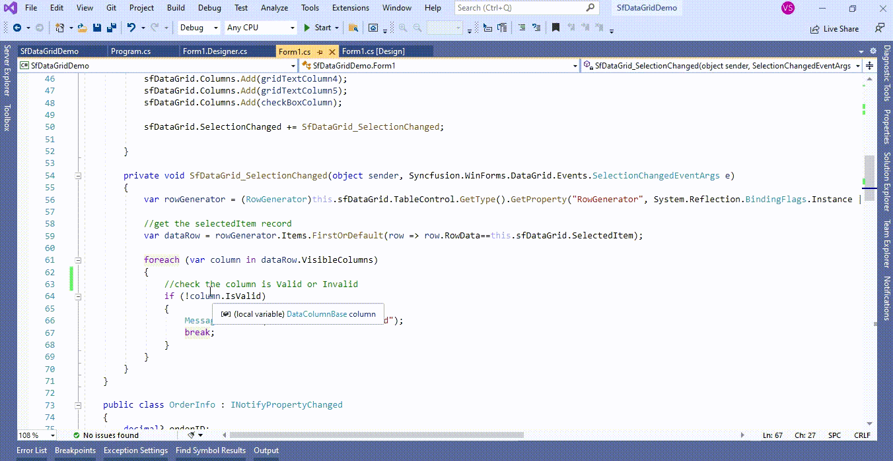
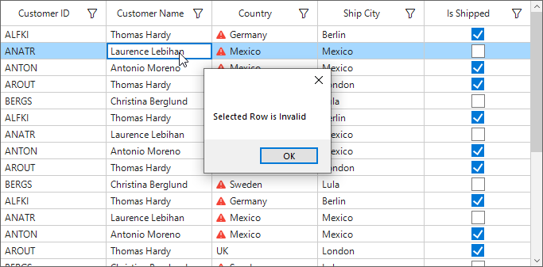

# How to apply selection based validation on a selected row in WinForms DataGrid (SfDataGrid)?

## About the sample
This example illustrates how to apply selection based validation on a selected row in [WinForms DataGrid](https://www.syncfusion.com/winforms-ui-controls/datagrid) (SfDataGrid)?)?

[WinForms DataGrid](https://www.syncfusion.com/winforms-ui-controls/datagrid) (SfDataGrid) allows to validate the data and display hints in case of validation is not passed. In case of invalid data, error icon is displayed at the left corner of cell. While selecting a row in [WinForms DataGrid](https://www.syncfusion.com/winforms-ui-controls/datagrid) (SfDataGrid) If any of the selected rows contains invalid data, displaying the Message Box by customization the [SelectionChanged](https://help.syncfusion.com/cr/windowsforms/Syncfusion.WinForms.DataGrid.SfDataGrid.html#Syncfusion_WinForms_DataGrid_SfDataGrid_SelectionChanged) event in [WinForms DataGrid](https://www.syncfusion.com/winforms-ui-controls/datagrid) (SfDataGrid). 

```C#
sfDataGrid.SelectionChanged += SfDataGrid_SelectionChanged;

private void SfDataGrid_SelectionChanged(object sender, Syncfusion.WinForms.DataGrid.Events.SelectionChangedEventArgs e)
{
        var rowGenerator = (RowGenerator)this.sfDataGrid.TableControl.GetType().GetProperty("RowGenerator", System.Reflection.BindingFlags.Instance | System.Reflection.BindingFlags.NonPublic).GetValue(this.sfDataGrid.TableControl);

        //get the selectedItem record
        var dataRow = rowGenerator.Items.FirstOrDefault(row => row.RowData==this.sfDataGrid.SelectedItem);           
          
        foreach (var column in dataRow.VisibleColumns)
        {
            //check the column is Valid or Invalid
            if (!column.IsValid)
            {
                MessageBox.Show("Selected Row is Invalid");
                break;
            }
        }
}

```


The following screenshot shows while the selected row contains invalid data, displaying the Message Box in [WinForms DataGrid](https://www.syncfusion.com/winforms-ui-controls/datagrid) (SfDataGrid),



Take a moment to peruse the [WinForms DataGrid - Data Validation](https://help.syncfusion.com/wpf/datagrid/data-validation) documentation, where you can find about Data Validation with code examples.

Please refer this [link](https://www.syncfusion.com/winforms-ui-controls/datagrid) to know about the essential features of WinForms DataGrid.

## Requirements to run the demo
Visual Studio 2015 and above versions
